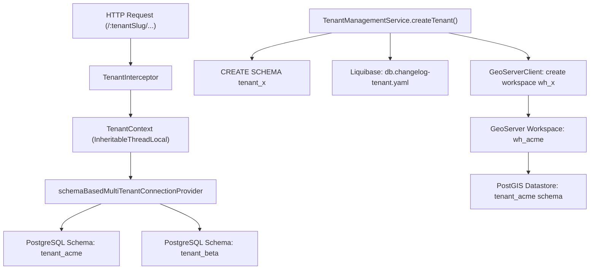
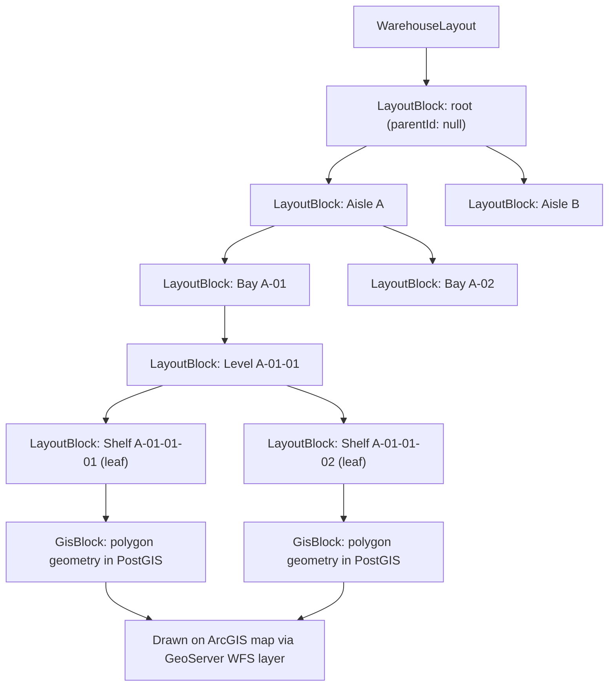
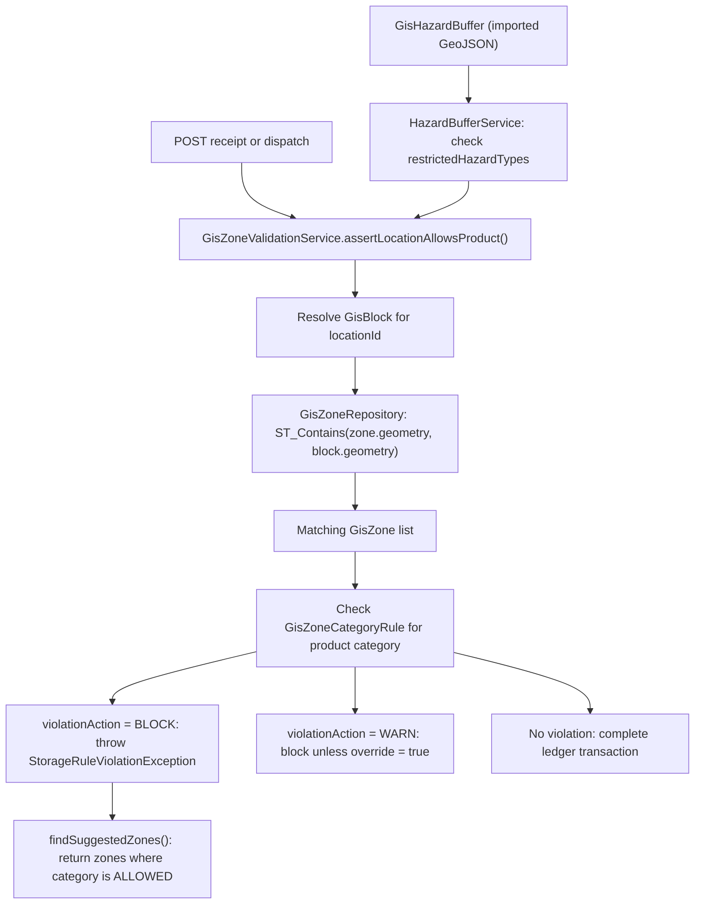

# warehouse-gis

A multi-tenant warehouse management system with a GIS layer for spatial inventory control.

## Why this exists

Most WMS tools treat storage locations as abstract codes. This system maps them to real physical coordinates, so you can run spatial queries, enforce zone rules, and visualize your warehouse floor plan as actual geometry.

## Tech stack

* React 18, Vite, ArcGIS Maps SDK for JavaScript
* Spring Boot 3, Hibernate Spatial
* PostgreSQL 15 with PostGIS 3.4
* GeoServer 2.25.2 (WMS/WFS layer serving)
* Liquibase (schema migrations)
* Docker Compose
* i18n: English and Arabic

## Features

* Schema-per-tenant isolation: each warehouse gets its own PostgreSQL schema and GeoServer workspace
* Hierarchical block tree for warehouse layout (Aisle, Bay, Level, Shelf), with auto-generated scan codes
* Each block in the tree is drawn as a polygon on the floor plan map
* Spatial zone enforcement: prohibit product categories from entering specific areas using PostGIS geometry queries
* Hazard buffer management: import GeoJSON perimeters and restrict hazardous material placement
* Inventory ledger with receipts, dispatches, and stock-take sessions
* Barcode and QR code scanning that resolves to a physical map location
* IFC 3D model viewer for BIM integration
* RBAC with fine-grained permissions per feature area

## Multi-tenancy architecture

Each warehouse is a tenant. When a tenant is created, the system provisions three things in one transaction: a dedicated PostgreSQL schema, a Liquibase migration run against that schema, and a GeoServer workspace prefixed with `wh_` pointing at that schema's PostGIS tables.

Every HTTP request carries a `tenantSlug` in the URL path. The `TenantInterceptor` reads it, stores it in `TenantContext` via an `InheritableThreadLocal`, and Hibernate's `schemaBasedMultiTenantConnectionProvider` routes all queries to the correct schema. Async tasks use `TenantAwareTaskDecorator` to propagate the context across thread boundaries.

This works well for warehouses that need hard data isolation. It does not suit use cases where you need cross-tenant queries, since each schema is fully separate.



## GIS block tree

The warehouse layout is a tree of `LayoutBlock` entities. The root is the warehouse itself. Interior nodes are organizational units (Aisle, Bay, Level). Leaf nodes are the actual storage locations, typically shelves or bins. Only leaf nodes accept inventory.

Each block gets a `scanCode` generated from its position in the tree. A shelf at Aisle A, Bay 2, Level 1 gets the code `A-02-01`. The `fullCode` stores the complete path from root to that node.

When you publish a floor plan, every node in the tree that has been drawn in the editor becomes a `GisBlock`: a PostGIS geometry (polygon) stored in the tenant schema. The `LayoutToGisConversionService` can also auto-generate child polygons by subdividing a parent's bounding box, so you do not have to draw every shelf by hand.

The frontend renders the tree in `WarehouseLayoutsPage` using `flattenVisibleTree`, which walks the tree and tracks depth for indentation. Collapsing a node hides its subtree from the flat list.



Interior nodes are also drawn if they have been mapped in the floor plan editor. The layer panel in the viewer lets you toggle visibility by template type, so you can show only aisles, only shelves, or everything at once.

## GIS spatial analysis

Once blocks have geometry, you can do real spatial analysis. The two main features built on this are zones and hazard buffers.

Zones are polygons you draw over the floor plan. Each zone carries category rules: a product category can be `ALLOWED` or `PROHIBITED` within that zone. When a receipt or dispatch is posted, `GisZoneValidationService` runs a `ST_Contains` query against PostGIS to find all zones that contain the target shelf's geometry. If any zone has a `PROHIBITED` rule for the product's category, the operation is blocked or warned depending on the zone's `violationAction`. The response includes suggested alternative zones where the category is allowed.

Hazard buffers work the same way but are imported from external GIS tools (ArcGIS Pro GeoJSON exports are supported). Each buffer carries a list of restricted hazard types. If a product's hazard type matches a restriction in a buffer that intersects its location, the placement is rejected.

GeoServer publishes the `gis_zones` and `gis_hazard_buffers` tables as WMS layer groups, so they render on the map alongside the block polygons without extra API calls from the frontend.



## Installation

```bash
# 1. Copy environment config
cp .env.example .env

# 2. Fill in secrets (JWT keys, DB password, GeoServer credentials)
# See .env.example for all required variables

# 3. Start all services
docker compose --env-file .env up -d
```

The frontend is served by Nginx on `${FRONTEND_PORT}`. GeoServer is accessible at `http://localhost:${GEOSERVER_PORT:-8600}/geoserver` for admin access during setup.

For local development without Docker for the app itself:

```bash
# Start only infrastructure
docker compose -f docker-compose.dev.yml --env-file .env.dev up -d db geoserver

# Backend
cd backend
SPRING_PROFILES_ACTIVE=dev ./mvnw spring-boot:run

# Frontend
cd frontend
npm install
npm run dev
```

## Usage

After starting the stack, create a tenant via the landlord API:

```http
POST /landlord/tenants
Content-Type: application/json

{
  "slug": "acme",
  "name": "ACME Warehouse"
}
```

This creates the `acme` PostgreSQL schema, runs migrations, and provisions a `wh_acme` GeoServer workspace. An admin user is seeded into the tenant schema automatically.

For development, seed a full demo warehouse with 3 aisles, 4 bays, 3 shelves, 20 products, and GIS block geometry:

```http
POST /acme/dev/seed?withGis=true
Authorization: Bearer <token>
```

Then open the floor plan editor at `/:tenantSlug/gis/floor-plans` to upload an SVG base map and draw or auto-generate block polygons. Once published, the map viewer at `/:tenantSlug/gis/map` shows all layers.

The Bruno API collection in `.bruno/` has pre-configured requests for all endpoints, including zone management, hazard buffer import, and inventory operations.

## License

MIT
